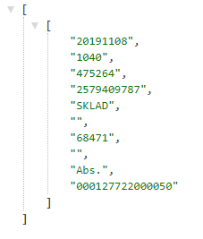
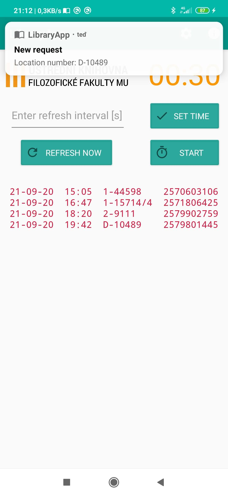
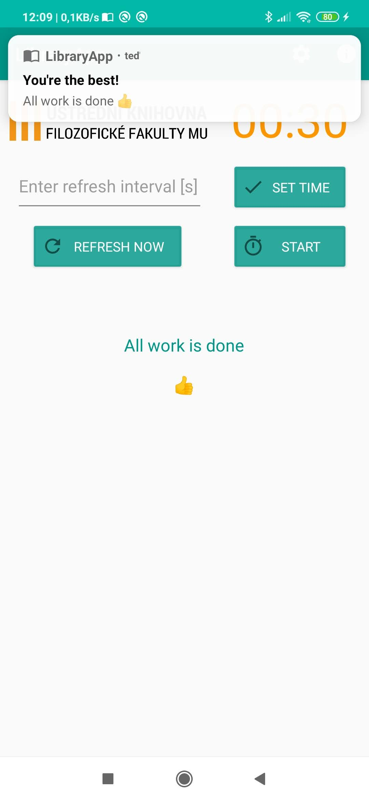
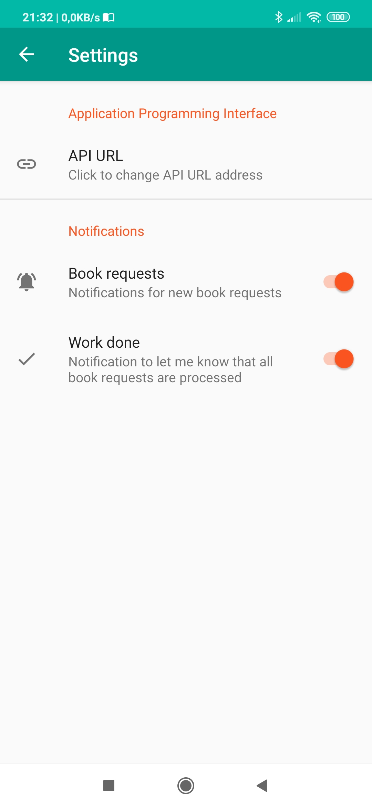
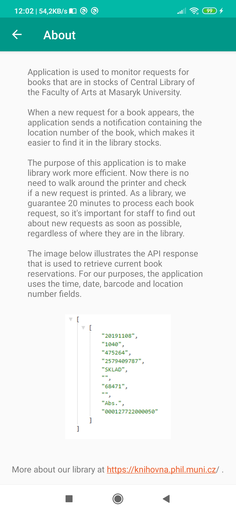

# LibraryApp

### WHAT IT IS
Application is used to monitor requests for books that are in stocks of **Central Library of the Faculty of Arts at Masaryk University**. More about our library at https://knihovna.phil.muni.cz/ .

**When a new request for a book appears, the application sends a notification containing the location number of the book, which makes it easier to find it in the library stocks.**

#### System Requirements
- Minimal SDK version: 26 (Android 8.0)
- Target SDK version: 30 (Android 10.0+)

### WHY
The purpose of this application is to **make librarians work more efficient**. As a library, **we guarantee 20 minutes to process each book request**, so it's important for staff to find out about new requests as soon as possible, regardless of where they are in the library.
All book requests that are displayed in the application always have one of three colors - green, orange or red. Color indicates remaining time to process given book request in guaranteed time.
- &#x1F4D7; Green - plenty of time
- &#x1F4D2; Orange - half of the guaranteed time is gone
- &#x1F4D5; Red - guaranteed time has expired

### API response
The image below illustrates the API response that is used to retrieve current book reservations. For our purposes, the application uses the time, date, barcode and location number fields.**Currently there is option to set custom URL to API, but it will work only with exact same response structure as illustrated by image below**.
      

### HOW IT LOOKS

 

 
