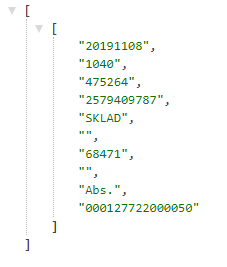
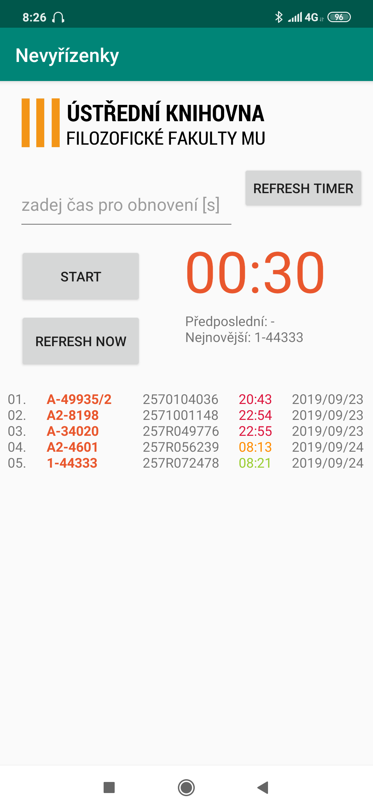
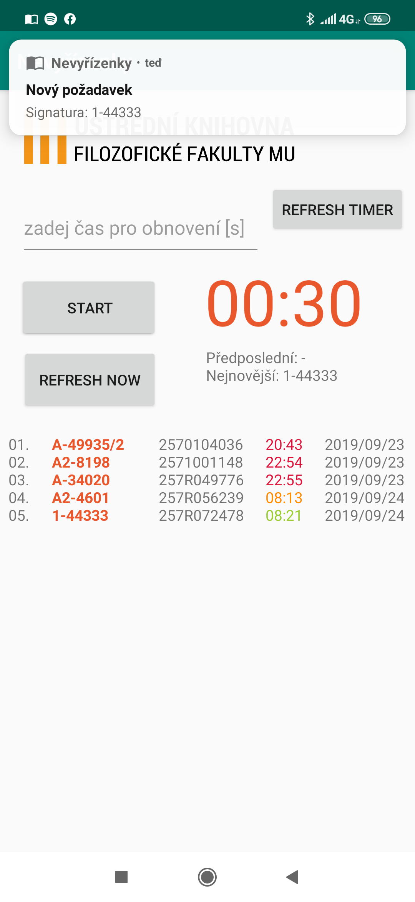

# BookReservations

Application for managing book requests from the library stocks.
My first experience with Java and the development of a mobile application.

### USAGE
The application uses a request to extract data from the API and then print it and sort it on the screen. The API requires a password that is not available in the repository files.

Example of API response that the application works with (it is a record of one request, ie one book).

### HOW IT LOOKS

 
