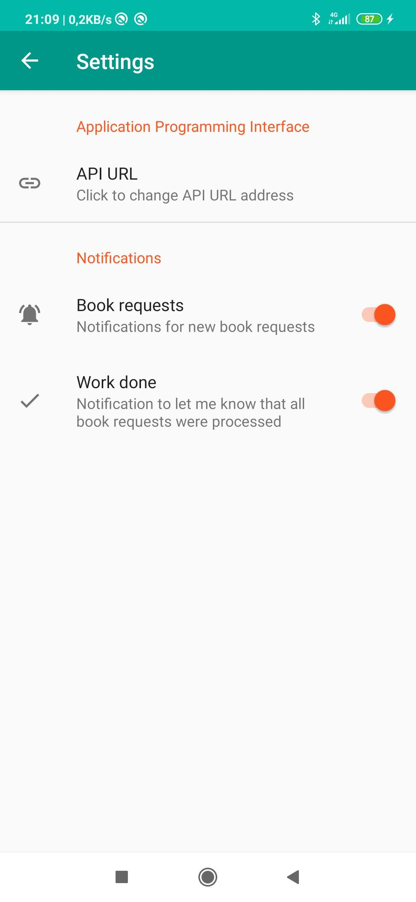

# LibraryApp

### WHAT IT IS
Application is used to monitor requests for books that are in stocks of Central Library of the Faculty of Arts at Masaryk University. More about our library at https://knihovna.phil.muni.cz/ .

When a new request for a book appears, the application sends a notification containing the location number of the book, which makes it easier to find it in the library stocks.

### WHY
The purpose of this application is to make library work more efficient. Now there is no need to walk around the printer and check if a new request is printed. As a library, we guarantee 20 minutes to process each book request, so it's important for staff to find out about new requests as soon as possible, regardless of where they are in the library.

### API response
The image below illustrates the API response that is used to retrieve current book reservations. For our purposes, the application uses the time, date, barcode and location number fields."
      

### HOW IT LOOKS

 
 
